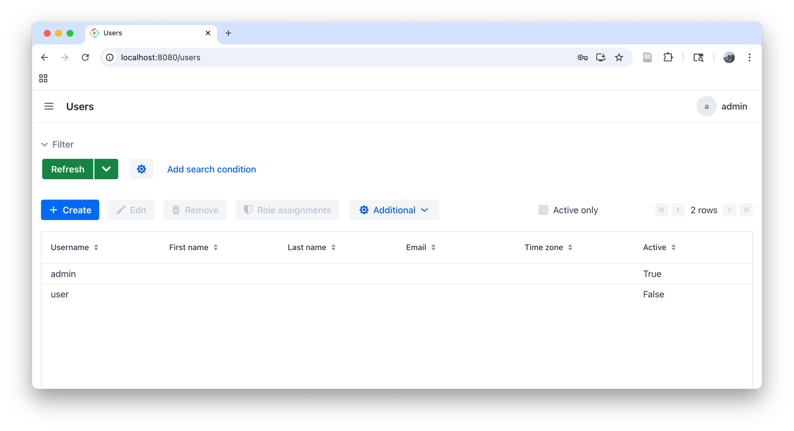
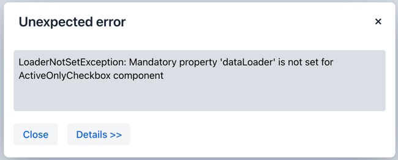
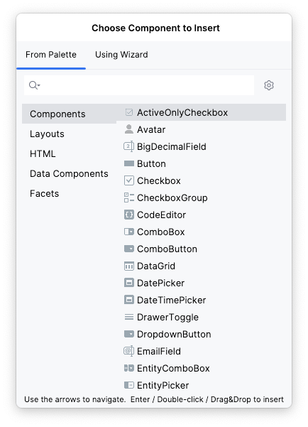
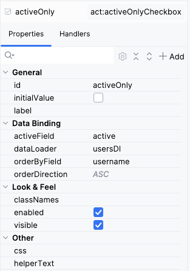

[](http://www.apache.org/licenses/LICENSE-2.0)

[](https://github.com/glebfox/jmix-localized-string-datatype-addon/releases)

# Jmix Active-Only Checkbox Addon

This addon provides a custom checkbox that can filter the content of the datagrid by the boolean _active_ field.
For example, add it to the standard _user list view_, and you will be able easily switch between viewing all users or only active:



Just one click — and inactive records are hidden:


In many enterprise systems, domain entities contain a boolean attribute that indicates whether a record is currently 
active or no longer in use. This may represent different business conditions—for example, an employee who has left 
the company or a product that is no longer available.

Such records usually must remain in the database to preserve referential integrity, auditing, or historical analysis. 
As a result, standard CRUD list views often contain a large number of inactive items, which reduces usability.

To address this, applications typically implement an “active-only” filter in list views. 
While straightforward, this logic is usually duplicated across multiple screens and requires repetitive boilerplate code.

Active-Only Checkbox eliminates this duplication by providing a reusable UI component that toggles between:

- displaying only active records, and

- displaying all records (including inactive ones) when investigation or historical analysis is required.

With this component, you can add active/inactive filtering to your list views declaratively,
without writing custom filtering logic for each screen.

## Installation

The following table shows which version of the add-on is compatible with which version of the platform:

| Jmix Version | Add-on Version | Implementation                                              |
|--------------|----------------|-------------------------------------------------------------|
| 2.7.0+       | 1.0.0          | com.digitilius.jmix:jmix-active-only-checkbox-starter:1.0.0 |

For manual installation, add the following dependencies to your `build.gradle`:

```groovy
     implementation 'com.digitilius.jmix:jmix-active-only-checkbox-starter:<addon-version>'
```

## Using the Addon

Add the component to your view, configure the boolean field used to determine activity, and optionally define ordering. 
No additional code is required.

The add-on provides a custom UI component based on the standard JmixCheckbox. 
It can be used in any entity list view to filter records by a boolean attribute—for example, an active field in a users list.

### Configuration

The component is configured declaratively via XML attributes:

| Property         | Description                                                  | Default  |
|------------------|--------------------------------------------------------------|----------|
| `activeField`    | Name of the boolean attribute used for filtering.            | `active` |
| `initialValue`   | Initial state of the checkbox (`true` or `false`).           | `false`  |
| `orderByField`   | Entity attribute used for sorting when the filter is applied. | `name`   |
| `orderDirection` | Sort direction. (`ASC` or `DESC`)                            | `ASC`    |
| `dataLoader`     | ID of the data loader associated with the list view. <br/>It is is **mandatory**. | —        |

The loader is re-executed on checkbox toggle.

If the loader isn't set, an exception will be thrown:



### Adding component th views

You can add this component to any view from the top menu:



And then set up its properties:





As well, you can add it directly in XML.

First, add a namespace:

```xml
<view xmlns="http://jmix.io/schema/flowui/view"
      xmlns:act="http://digitilius.com/schema/active-only-checkbox"
      title="msg://UserListView.title"
      focusComponent="usersDataGrid">
```

Then, add the component, usually to datagrid buttons panel:

```xml
        <act:activeOnlyCheckbox id="activeOnly"
                                activeField="active"
                                orderByField="username"
                                dataLoader="usersDl"
                                initialValue="false"/>
```

## License

Code is under the [Apache Licence 2.0](http://www.apache.org/licenses/LICENSE-2.0).